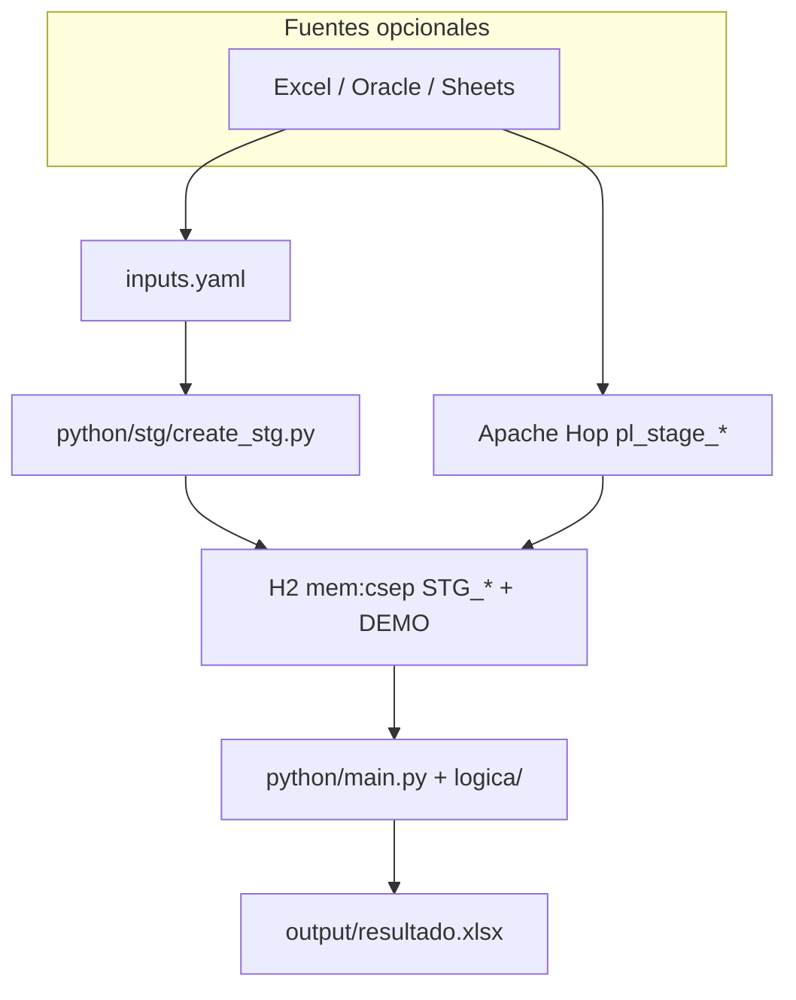

# Arquitectura — arquetipo mínimo

ETL **Apache Hop + H2 in-memory + Python**. Demo: `DEMO_TABLA_EJEMPLO` → `logica/demo.py` → Excel.

## Vista general

| Capa | Responsabilidad |
|---|---|
| `inputs.yaml` | Declara fuentes → tablas `STG_*` |
| `create_stg.py` | DDL H2 (sin filas) — `python/stg/` |
| `stage_rdata.py` | RData → H2 — `python/stage/` |
| `main.py` + `logica/` | Reglas post-STG → `DW_INF_CONSOL_RDATA` (TRUNCATE) |
| `pl_form_informes.hpl` | MySQL → `DW_INF_CONSOL_FORM` (TRUNCATE) |
| `pl_csep_informes.hpl` | SISUD vista → `DW_INF_CSEP_INFORMES_VIEW` (TRUNCATE) |
| `sql/dw/` | CREATE Oracle una vez (manual) |
| Hop | FORM/CSEP + orquestación `wf_main` |
| `logica/` | Reglas de negocio RData (un `.py`) |
| H2 | Staging RData efímero (reset cada corrida) |

## Workflows

| Workflow | Uso |
|---|---|
| `wf_create_stg.hwf` | Diseño: deja H2 vivo para mapear pipelines |
| `wf_main.hwf` | Corrida: Reset → STG → RData → Python RDATA → pl_form → pl_csep |

## Extender

Ver [`README.md`](../README.md) y skill [`.agents/skills/hop-python-etl/`](../.agents/skills/hop-python-etl/SKILL.md).

Para un DW Oracle (dims/facts): copiar `cargar_dw.py` y, si aplica, `logica/dwh/` desde el repo de referencia (multa).
