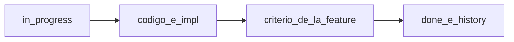

# Workflow

Estado en disco, una feature a la vez, verificación = el criterio de [`feature_list.json`](../../feature_list.json).

| Rol | Quién | Hace |
|---|---|---|
| **Líder** | Usuario o agente principal | Elige la feature y la deja `in_progress` en `feature_list.json` y `progress/current.md` |
| **Implementador** | Agente | Código, `progress/impl_<id>.md` y la prueba que pide el criterio |

No hay revisor obligatorio. Una revisión (bugbot u otra) solo corre si alguien la pide.

## Ciclo

1. Una sola feature `in_progress`.
2. Implementar. Escribir `progress/impl_<id>.md` con archivos tocados y el resultado de la prueba.
3. Ejecutar lo que dice el campo `criterio`. Para el diario, `./init.sh` → **HARNESS OK** (FORM, CSEP y conteo `PK_OFICINA`). RData no entra en ese script.
4. Pasar a `done` y append en [`progress/history.md`](../../progress/history.md).

El ítem y el código se cierran en el mismo trabajo. Compuertas globales: [`CHECKPOINTS.md`](../../CHECKPOINTS.md).

## Skill

[`hop-python-etl`](../../.agents/skills/hop-python-etl/SKILL.md) dice cómo está armado el ETL. Este documento dice cómo cerrar un cambio.
